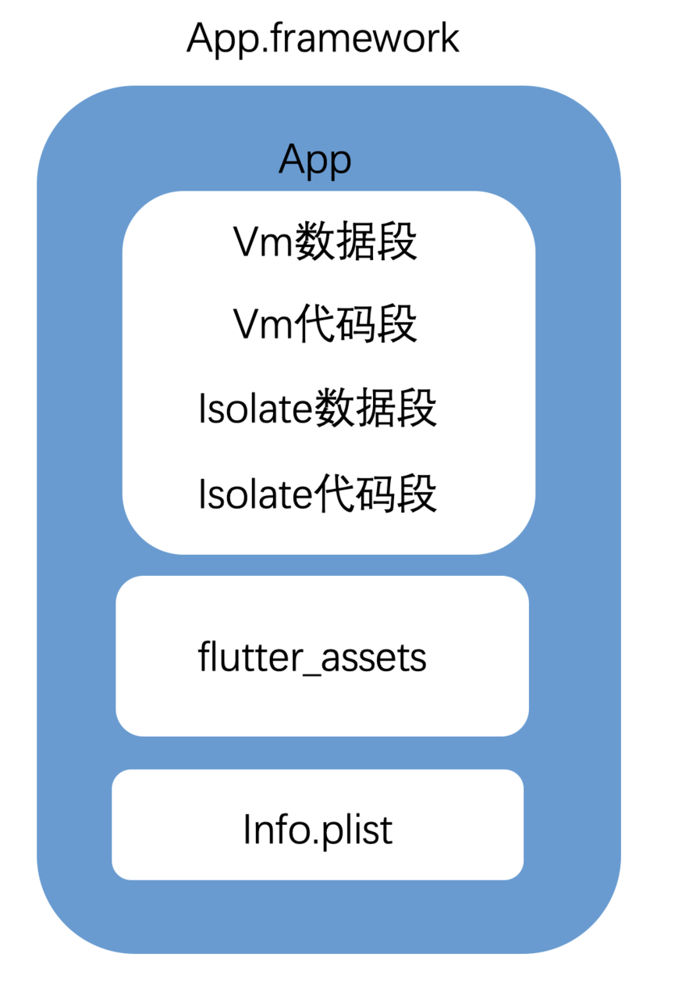

# 深入理解flutter原理（二）
## 2 `AOT` 下包体积减少问题
### 本文通过实践并给出 `demo` 和全部修改过的源代码，通过分离Vm数据段、Isolate数据段和flutter——asserts，介绍 `flutter` 包体积优化大概方案


## 2.1 首先，你需要翻墙，最好保证整个过程中可以访问国外资源
## 2.2 下载 `flutter`, 切换到你想要的 `flutter`版本
```
git tag

...
v1.12.13
v1.12.13+hotfix.1
v1.12.13+hotfix.2
v1.12.13+hotfix.3
v1.12.13+hotfix.4
v1.12.13+hotfix.5
v1.12.13+hotfix.6
v1.12.13+hotfix.7
v1.12.13+hotfix.8
v1.12.13+hotfix.9
v1.12.14
v1.12.15
v1.12.16
v1.12.2
v1.12.3
...

git checkout v1.12.13+hotfix.9
```
## 2.3 打开 `engine` 目录，检出对应版本号, `engine` 相关初始化请看 [深入理解flutter原理（一）](https://github.com/673697831/flutter_engine_share) 这篇

```
git checkout v1.12.13-hotfixes
git checkout af51afceb
```
### 同步代码
```
gclient sync
```
## 2.4 生成iOS工程，编译
### 生成arm64下的优化工程
```
./flutter/tools/gn --ios --runtime-mode=release
````
### 生成armv7下的优化工程
```
./flutter/tools/gn --runtime-mode=release --ios --ios-cpu=arm
````
### 生成arm64下的未经优化工程，用于 `debug`
```
./flutter/tools/gn --ios --runtime-mode=release --unoptimized
````
### 生成armv7下的未经优化工程，用于 `debug`
```
./flutter/tools/gn --runtime-mode=release --ios --ios-cpu=arm --unoptimized
````
### 编译的你所需要的工程
```
ninja -C out/ios_release
ninja -C out/ios_release_arm
ninja -C out/ios_release_unopt
ninja -C out/ios_release_unopt_arm
````

## 2.5 分离数据段

### `flutter build` 后，生成数据段和代码段的代码在 `AssemblyImageWriter::WriteText` 这个函数里面
### `[-> third_party/dart/runtime/vm/image_snapshot.cc]`
### 在函数的末尾处
```
  const char* data_symbol =
      vm ? "_kDartVmSnapshotData" : "_kDartIsolateSnapshotData";
  assembly_stream_.Print(".globl %s\n", data_symbol);
  assembly_stream_.Print(".balign %" Pd ", 0\n", kMaxObjectAlignment);
  assembly_stream_.Print("%s:\n", data_symbol);
  uword buffer = reinterpret_cast<uword>(clustered_stream->buffer());
  intptr_t length = clustered_stream->bytes_written();
  WriteByteSequence(buffer, buffer + length);
```
这里是生成的是snapshot_assembly.S。`我们要做代码段和数据段分离修改的就是这个c++函数，首先改掉代码不写进snapshot_assembly.S，在另外的地方把二进制数据保存起来。后面通过修改engine的加载流程从外部加载这二进制数据，即可达到分离代码段和数据段的目的。`我们区分iOS和安卓，只对iOS的产物就行修改
```
#if defined(TARGET_OS_LINUX) || defined(TARGET_OS_ANDROID) ||                  \
    defined(TARGET_OS_FUCHSIA)
  assembly_stream_.Print(".section .rodata\n");
  const char* data_symbol =
      vm ? "_kDartVmSnapshotData" : "_kDartIsolateSnapshotData";
  assembly_stream_.Print(".globl %s\n", data_symbol);
  assembly_stream_.Print(".balign %" Pd ", 0\n", kMaxObjectAlignment);
  assembly_stream_.Print("%s:\n", data_symbol);
  uword buffer = reinterpret_cast<uword>(clustered_stream->buffer());
  intptr_t length = clustered_stream->bytes_written();
  WriteByteSequence(buffer, buffer + length);
#elif defined(TARGET_OS_MACOS) || defined(TARGET_OS_MACOS_IOS)
  // assembly_stream_.Print(".const\n");
  std::string data_symbol_name = vm ? "_kDartVmSnapshotData" : "_kDartIsolateSnapshotData";
  std::ofstream ouF;
  std::string file_path_prefix = "build/aot/arm64/";
  #if defined(TARGET_ARCH_ARM) 
    file_path_prefix = "build/aot/armv7/";
  #endif
  std::string file_path = file_path_prefix + data_symbol_name;
  OS::Print("file_path  %s \n", file_path.c_str());
  ouF.open(file_path + ".dat", std::ofstream::binary);
  uword start = reinterpret_cast<uword>(clustered_stream->buffer());
  intptr_t l = clustered_stream->bytes_written();
  uword end = start + l;
  for (auto* cursor = reinterpret_cast<compiler::target::uword*>(start);
      cursor < reinterpret_cast<compiler::target::uword*>(end); cursor++) {
      ouF.write((const char *)cursor, sizeof(compiler::target::uword));
  }
  ouF.close();
#else
  UNIMPLEMENTED();
#endif
```

## 2.6 加载数据段
### 加载数据段的代码在这里面
### `[-> flutter/runtime/dart_snapshot.cc]`
### 我们分别修改`std::shared_ptr<const fml::Mapping> ResolveVMData`和`std::shared_ptr<const fml::Mapping> ResolveIsolateData`这两个函数
```
static std::shared_ptr<const fml::Mapping> ResolveVMData(
    const Settings& settings) {
#if DART_SNAPSHOT_STATIC_LINK
  return std::make_unique<fml::NonOwnedMapping>(kDartVmSnapshotData, 0);
#else   // DART_SNAPSHOT_STATIC_LINK
  if (settings.vm_snapshot_data_ptr != NULL){
    auto symbol_mapping = std::make_unique<const fml::SymbolMapping>(
        settings.vm_snapshot_data_ptr);
    return symbol_mapping;
    // return SearchMapping(
    //   settings.vm_snapshot_data,          // embedder_mapping_callback
    //   settings.vm_snapshot_data_path,     // file_path
    //   settings.application_library_path,  // native_library_path
    //   DartSnapshot::kVMDataSymbol,        // native_library_symbol_name
    //   false                               // is_executable
    // );
  } else {
    return SearchMapping(
      settings.vm_snapshot_data,          // embedder_mapping_callback
      settings.vm_snapshot_data_path,     // file_path
      settings.application_library_path,  // native_library_path
      DartSnapshot::kVMDataSymbol,        // native_library_symbol_name
      false                               // is_executable
    );
  }
#endif  // DART_SNAPSHOT_STATIC_LINK
}
```
```
static std::shared_ptr<const fml::Mapping> ResolveIsolateData(
    const Settings& settings) {
#if DART_SNAPSHOT_STATIC_LINK
  return std::make_unique<fml::NonOwnedMapping>(kDartIsolateSnapshotData, 0);
#else   // DART_SNAPSHOT_STATIC_LINK
  if (settings.isolate_snapshot_data_ptr != NULL) {
    auto symbol_mapping = std::make_unique<const fml::SymbolMapping>(
          settings.isolate_snapshot_data_ptr);
    return symbol_mapping;
    // return SearchMapping(
    //   settings.isolate_snapshot_data,       // embedder_mapping_callback
    //   settings.isolate_snapshot_data_path,  // file_path
    //   settings.application_library_path,    // native_library_path
    //   DartSnapshot::kIsolateDataSymbol,     // native_library_symbol_name
    //   false                                 // is_executable
    // );
  } else {
    return SearchMapping(
      settings.isolate_snapshot_data,       // embedder_mapping_callback
      settings.isolate_snapshot_data_path,  // file_path
      settings.application_library_path,    // native_library_path
      DartSnapshot::kIsolateDataSymbol,     // native_library_symbol_name
      false                                 // is_executable
    );
  }
#endif  // DART_SNAPSHOT_STATIC_LINK
}
```
### 另外我为 `SymbolMapping` 添加了一个构造函数作为返回
### ``` [-> flutter/fml/mapping.h] ```
```
//新增一个构造函数直接传如外部数据
SymbolMapping(const uint8_t * data);
```
### ``` [-> flutter/fml/mapping.cc] ```
```
SymbolMapping::SymbolMapping(const uint8_t * data)
{
    mapping_ = data;
}
```
### 为 `setting` 添加了新字段, 把值通过外部传入
### ```[-> flutter/common/setting.cc]```
```
  const uint8_t* vm_snapshot_data_ptr;

  const uint8_t* isolate_snapshot_data_ptr;
```


## 2.7 分离flutter_asserts
### 具体生成flutter_assets的代码在bundle.dart文件
### ```[-> packages/flutter_tools/lib/src/bundle.dart]```
```
Future<void> build({
    @required TargetPlatform platform,
    BuildMode buildMode,
    String mainPath,
    String manifestPath = defaultManifestPath,
    String applicationKernelFilePath,
    String depfilePath,
    String privateKeyPath = defaultPrivateKeyPath,
    String assetDirPath,
    String packagesPath,
    bool precompiledSnapshot = false,
    bool reportLicensedPackages = false,
    bool trackWidgetCreation = false,
    List<String> extraFrontEndOptions = const <String>[],
    List<String> extraGenSnapshotOptions = const <String>[],
    List<String> fileSystemRoots,
    String fileSystemScheme,
  }) async {
    mainPath ??= defaultMainPath;
    depfilePath ??= defaultDepfilePath;
    assetDirPath ??= getAssetBuildDirectory();
    printStatus("assetDirPath" + assetDirPath);
    printStatus("mainPath" + mainPath);
    packagesPath ??= fs.path.absolute(PackageMap.globalPackagesPath);
    final FlutterProject flutterProject = FlutterProject.current();
    await buildWithAssemble(
      buildMode: buildMode ?? BuildMode.debug,
      targetPlatform: platform,
      mainPath: mainPath,
      flutterProject: flutterProject,
      outputDir: assetDirPath,
      depfilePath: depfilePath,
      precompiled: precompiledSnapshot,
      trackWidgetCreation: trackWidgetCreation,
    );
    // Work around for flutter_tester placing kernel artifacts in odd places.
    if (applicationKernelFilePath != null) {
      final File outputDill = fs.directory(assetDirPath).childFile('kernel_blob.bin');
      if (outputDill.existsSync()) {
        outputDill.copySync(applicationKernelFilePath);
      }
    }
    return;
  }

```
### 这里assetDirPath就是最终打包产生bundle产物的路径，我们只要修改这个路径
```
if(platform == TargetPlatform.ios && buildMode.isRelease) {
  printStatus("flutterProject" + flutterProject.directory.path);
  assetDirPath = flutterProject.directory.childDirectory("build").childDirectory("flutter_assets").path;
}
```
## 2.8 从外部设置加载路径
### `[-> flutter/shell/plaform/darwin/ios/framework/Source/FlutterDartProject.mm]`
### 从外部设置flutter_assets的路径
```
// Checks to see if the flutter assets directory is already present.
if (settings.assets_path.size() == 0) {
  NSString* assetsName = [FlutterDartProject flutterAssetsName:bundle];
  NSString* assetsPath = [bundle pathForResource:assetsName ofType:@""];

  if (assetsPath.length == 0) {
    assetsPath = [mainBundle pathForResource:assetsName ofType:@""];
  }
    
  //从外部设置flutter_assets的路径
  if (assetsPath.length == 0) {
      assetsPath = [mainBundle pathForResource:@"flutter_assets" ofType:@"bundle"];
  }

  if (assetsPath.length == 0) {
    NSLog(@"Failed to find assets path for \"%@\"", assetsName);
  } else {
    settings.assets_path = assetsPath.UTF8String;
```
### 从外部设置数据段的加载路径
```
//数据段分离 从外部设置路径
NSString *isolatePath = [[NSBundle mainBundle] pathForResource:@"_kDartIsolateSnapshotData" ofType:@"dat"];
if (isolatePath) {
  NSData *data = [[NSData dataWithContentsOfFile:isolatePath] retain];
  if (data) {
    const uint8_t* mapData = (const uint8_t *)[data bytes];
    settings.isolate_snapshot_data_ptr = mapData;
  }
}

NSString *vmPath = [[NSBundle mainBundle] pathForResource:@"_kDartVmSnapshotData" ofType:@"dat"];
if (vmPath) {
  NSData *data = [[NSData dataWithContentsOfFile:vmPath] retain];
  if (data) {
    const uint8_t* mapData = (const uint8_t *)[data bytes];
    settings.vm_snapshot_data_ptr = mapData;
  }
}
```

## 2.9 重新编译 `aot` 产物
```
ninja -C out/ios_release && ninja -C out/ios_release_arm
```

## 2.10 产物替换
### 生成的产物如下

### 把编译后的 `flutter.framework` 和 `gen_snapshot` 文件拷贝到flutter目录下，下图的位置即可

### 注意，engine是分架构的，arm64的gen_snapshot名字是gen_snapshot_arm64，armv7的gen_snapshot名字是gen_snapshot_armv7，完成替换后，我们定制的代码就可以生效了。

### 合并架构
```
lipo -create /Users/zhiruiou/Desktop/flutter_engine/engine/src/out/ios_release/Flutter.framework/Flutter /Users/zhiruiou/Desktop/flutter_engine/engine/src/out/ios_release_arm/Flutter.framework/Flutter -output Flutter
```

### 删掉[->bin/cache/flutter_tools.snapshot]

## 2.11 编译项目查看效果
```
flutter build ios --release --no-codesign
```

### 官方engine生成的App.framework构成如下，其中App动态库二进制文件19.2M，flutter_assets有3.3M，共22.5M。


### 用分离产物的engine生成的App.framework构成如下，只剩App动态库二进制文件14.8M。


## 2.12 运行demo验证
### [github](https://github.com/673697831/flutter_engine_test)上下载domo，不做任何改动，用64位真机直接运行。
- 直接查看最终效果
### demo里面包含已经编译好的最终产物并直接依赖，直接打开项目连接真机便可运行
```
cd yydemo
pod update
```  
- 用生成的产物编译其他项目

### 把github上的Flutter.framework覆盖掉[->/bin/cache/artifacts/engine/ios-release/Flutter.framework]这个目下的Flutter.framework

### 把github上的gen_snapshot_arm64覆盖掉[->/bin/cache/artifacts/engine/ios-release/gen_snapshot_arm64]

### 把github上的gen_snapshot_armv7覆盖掉[->/bin/cache/artifacts/engine/ios-release/gen_snapshot_armv7]

### 然后把github上的bundle.dart覆盖掉[->packages/flutter_tools/lib/src/bundle.dart]目录下的bundle.dart文件

### 然后删掉[->bin/cache/flutter_tools.snapshot],这个文件是dart项目生成的二进制文件，删除了新的bundle.dart才能生效

### 编译你指定的flutter项目
```
flutter build ios --release --no-codesign
```

### 把生成的`_kDartIsolateSnapshotData.dat`和`_kDartVmSnapshotData.dat`直接拖进你的xcode工程

### 在你的工程里面新建一个`flutter_assets.bundle`

### 把`build`目录下生成的`flutter_assets`里面的全部文件拖进去`flutter_assets.bundle`


### 你可以指定你的xcode工程，在release模式下只编译arm64架构


### 运行工程查看效果


# 参考文档
### [Flutter 一共可以生成多少个工程](https://github.com/flutter/flutter/wiki/Flutter%27s-modes)
### [手把手教你分离flutter ios 编译产物--附工具](https://juejin.im/post/5e5a492be51d452716050a11?from=timeline&isappinstalled=0)
### [Flutter 沙龙回顾 | 如何缩减接近 50% 的 Flutter 包体积](https://mp.weixin.qq.com/s/Ls3cDcqjlyOX80PXUO0wRw)